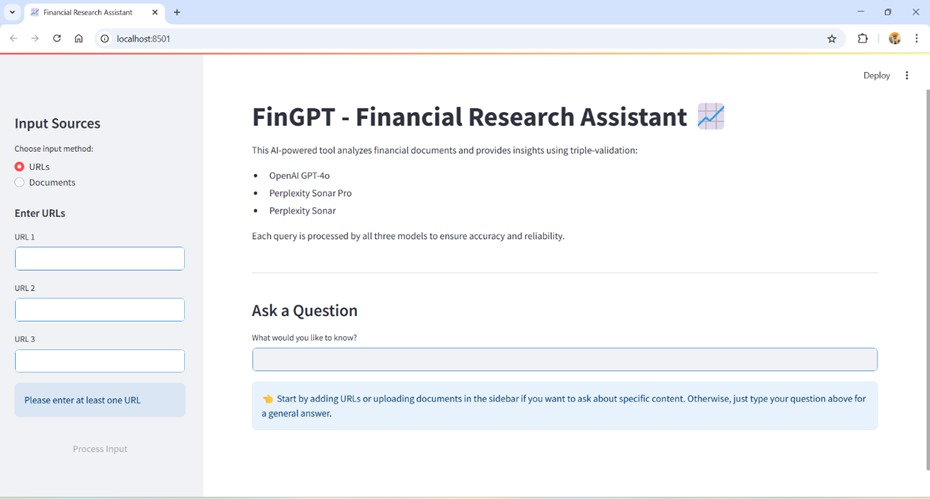

# FinGPT: LLM Driven Market News Research Tool 📈

FinGPT is an advanced market news research web application designed specifically for equity analysts. It leverages powerful language models and NLP techniques to deliver accurate, validated, and insightful financial insights.



## 🌟 Features

- **URL Analysis**: Input and analyze financial articles via URLs.

- **Document Upload**: Extract structured text data from financial documents (images, scanned PDFs, graphical charts).

- **Triple-Check AI Validation**: Provides cross-validated insights using:

    - OpenAI's GPT-4o

    - Perplexity's Sonar Pro

    - Perplexity's Sonar

- **Contextual Insights**: Uses Retrieval-Augmented Generation (RAG) to generate accurate responses based on retrieved context from uploaded documents and URLs.

- **Interactive UI**: Streamlit-based responsive web interface.


## 🛠️ Technical Overview
FinGPT incorporates advanced software engineering concepts:

- **Modular System Design**: Clearly defined component responsibilities, ensuring scalability and ease of maintenance.

- **Robust Software Principles**: Adherence to SOLID principles for maintainability and flexibility.

- **Parallel AI Execution**: Utilizes Python's ThreadPoolExecutor to concurrently handle AI model requests, optimizing response time.

- **Retrieval-Augmented Generation (RAG)**: Employs FAISS embeddings and LangChain retrieval methods to deliver highly accurate, context-based AI responses.

- **Integrated Cloud AI**: Direct integration with advanced cloud AI services (OpenAI, Perplexity, Google Vision OCR) to deliver highly accurate and validated insights.

- **Computer Vision OCR Processing**: Uses Google Vision OCR for efficient and precise text extraction from images and documents.


## 🗺️ Architecture

```
┌─────────────┐     ┌───────────────┐     ┌──────────────┐
│     UI      │────▶│  Processing   │────▶│ AI Services │
│ (Streamlit) │◀────│     Core      │◀────│ (API Calls) │
└─────────────┘     └───────────────┘     └──────────────┘
                           │
                           ▼
                    ┌──────────────┐
                    │  Vector DB   │
                    │   (FAISS)    │
                    └──────────────┘
 
```

## ⚙️ Technologies Used

- **Python 3.12**: Core programming language 
- **API Integrations**: OpenAI API, Perplexity API
- **LangChain**: NLP data handling
- **Google Cloud Vision API**: Optical Character Recognition
- **FAISS**: Efficient embedding-based similarity search
- **Streamlit**: Interactive, user-friendly web interface
- **Concurrent Processing**: Python's ThreadPoolExecutor

## 📂 Project Directory Structure
```
chatbot/
├── main.py                 # Entry point and Streamlit interface
├── requirements.txt        # Project dependencies
├── utils/                  # Utility modules
│   ├── __init__.py
│   ├── document_loader.py  # Document processing
│   ├── parallel_executor.py # AI model orchestration
│   ├── ai_processors.py    # AI model interfaces
│   └── ocr_processor.py    # OCR processing
├── faiss_index/           # Vector database storage
├── temp/                  # Temporary file storage
└── .venv/                 # Virtual environment

```

## 📐 Applied Design Patterns

- **Facade Pattern**: Simplifies interactions with external AI APIs
- **Strategy Pattern**: Enables flexible NLP and AI model selection
- **Pipeline Pattern**: Defines sequential processing workflow (URL/OCR → NLP → Embeddings → Response)

## 📋 Prerequisites
- Python 3.12
- Streamlit
- API keys:
    - Google Cloud Vision API (for OCR)
    - Perplexity API
    - OpenAI API

## 🚀 Installation

1. **Clone the repository:**
   ```
   git clone https://github.com/meghana-242002/FinGPT.git
   cd FinGPT
   ```

2. **Install the required packages:**
   ```
   pip install -r requirements.txt
   ```

3. **Create a .env file in the project directory with your API keys:**
   ```
   OPENAI_API_KEY=your_openai_api_key
   PERPLEXITY_API_KEY=your_perplexity_api_key
   GOOGLE_APPLICATION_CREDENTIALS=path_to_your_google_cloud_credentials.json
   ```

4. **Set up Google Cloud Vision API:**
   - Go to [Google Cloud Console](https://console.cloud.google.com/)
   - Create a new project or select an existing one
   - Enable the Cloud Vision API
   - Create a service account and download the JSON credentials
   - Save the JSON file in a secure location
   - Update the GOOGLE_APPLICATION_CREDENTIALS in .env with the path to your JSON file

5. **Run the application:**
   ```
   streamlit run main.py
   ```


